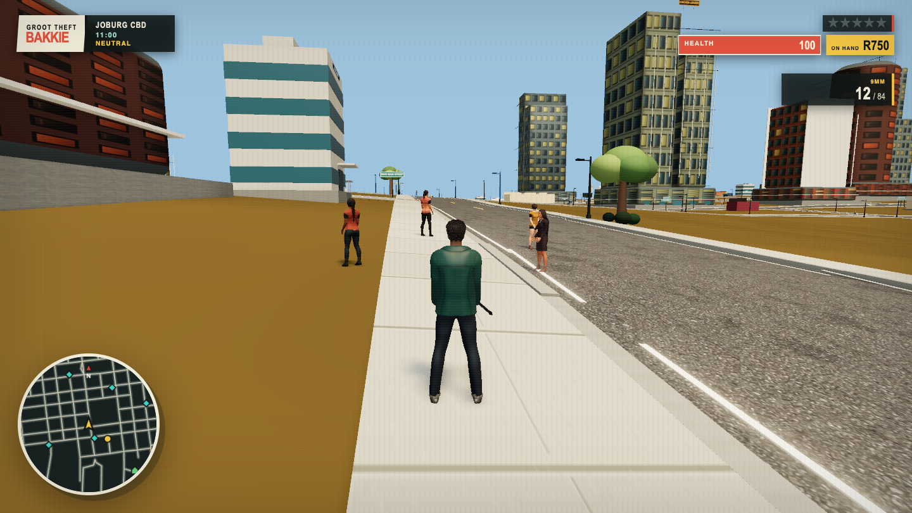

# Groot Theft Bakkie

An original open-world Jozi misadventure built with Three.js and TypeScript. Walk, drive, take questionable freelance work, annoy the JMPD, and try to keep the bakkie facing mostly forwards.

**Play the production build:** [groottheftbakkie.com](https://www.groottheftbakkie.com/)

The city combines OpenStreetMap-derived Johannesburg roads with procedural buildings, vegetation, traffic, pedestrians, shops, missions, a day/night cycle, and a deliberately impossible strip of coast. Cape Town kept the mountain, so Jozi borrowed the sea.



## What is in the game?

- A large Jozi map with 3,939 roads, 117 named districts, roughly 775 km of road, parks, water, landmarks, rural edges, an airport, and the entirely sensible Jozi-by-the-Sea.
- On-foot movement, third- and first-person cameras, cover, melee combat, firearms, armour, stim packs, parachutes, pickups, and a weapon wheel.
- An original 1.8 m skinned Johannesburg protagonist with a teal technical jacket, 24 authored gameplay clips, directional aim, vehicle and airborne poses, and strict retryable startup validation.
- A 16-character Blender-authored Johannesburg NPC cast. Every pedestrian uses a rigged character with independent animation, including ambient crowds, mission contacts, car guards, enforcers, drivers, and JMPD officers.
- A required Blender-authored library of jacarandas, shade trees, gums, pines, acacias, palms, and landmark trees, with two distinct silhouettes per species and deterministic size variation.
- Cars, bakkies, taxis, bicycles, delivery bikes, superbikes, vehicle damage, drive-bys, police sirens, and four synthesised radio stations.
- Traffic that follows lanes and robots. “Robot” means traffic light here; no metal oke is coming to steal your job.
- A five-star wanted system with witnesses, dispatch callouts, foot patrols, road pursuits, arrests, and persistent police pressure.
- Four story jobs, repeatable taxi work, and **Sixty-Sekonds** courier shifts for anyone who believes eggs are suspension components.
- Shops for weapons, armour, food, resprays, and garage storage, plus a safehouse where you can save, sleep, heal, and wait for things to become somebody else’s problem.
- A searchable city map, rotating minimap, district reputation, dynamic crowds, a ten-minute day/night cycle, weathered streets, and authentic load shedding at no additional charge.
- Procedural audio, vehicle engines, weapons, UI sounds, and original in-car stations inspired by amapiano, maskandi, gqom, and kwaito.

Everything is original or procedurally generated except the dependencies and credited source material listed in [ATTRIBUTIONS.md](ATTRIBUTIONS.md). No borrowed franchise maps, characters, dialogue, music, or logos are used.

## Quick start

You need Node.js 22.x and npm 10.x.

```bash
npm install
npm run dev
```

Open the URL printed by Vite, normally `http://localhost:5173`. Click the game view when the browser asks for pointer lock; the mouse cannot steer itself, despite what the taxi rank may claim.

For multiplayer development, build once and run the world server in a second terminal; Vite proxies WebSocket connections to it:

```bash
npm run build
npm run dev:multiplayer-server
```

## Multiplayer

Choose **Enter global world** on the main menu and supply a display name. Every online player joins the same 16-player world automatically—there are no rooms or matchmaking. Movement and pistol damage are server-authoritative, PvP is open, deaths respawn after three seconds, remote players appear on the minimap, and the scoreboard tracks kills and deaths. Press `Enter` for rate-limited global text chat.

Solo missions, money, wanted level, shops, jobs, saves, cheats, and reputation stay in the separate solo mode.

## Controls

| Input | Action |
| --- | --- |
| `WASD` | Move, drive, or steer in freefall |
| Mouse | Look and aim |
| `Shift` | Sprint |
| `Ctrl` / right mouse | Aim or fire a drive-by weapon |
| Left mouse | Fire or punch |
| `Space` | Jump, handbrake, or deploy/flare a parachute |
| `E` | Interact, enter/exit a vehicle, collect, shop, or use a safehouse |
| `Q` | Enter/leave cover in third-person view |
| `F` | Mug/melee, recover a vehicle, or deploy a parachute |
| `Tab` | Hold for the weapon wheel |
| Scroll / `1`–`6` | Cycle or directly select weapons; scroll also changes sniper zoom |
| `R` | Reload |
| `H` | Use a stim pack |
| `V` | Change camera view |
| `T` | Start or stop taxi duty in a Quantum Express minibus |
| `Y` | Start or stop a Sixty-Sekonds shift on its delivery bike |
| `N` / `Shift+N` | Next / previous radio station |
| `G` | Toggle the siren in a police car you definitely acquired legally |
| `M` | Open the searchable city map |
| `Page Up` / `Page Down` | Change minimap zoom |
| `Escape` | Pause |
| Backquote (`~`) | Open the developer console |

The field guide on the main and pause menus keeps this list in-game. The city map supports drag, wheel zoom, street and district search, hover names, and marker filters.

## Jobs and consequences

Gold markers identify contacts and current objectives. Walk up and press `E`.

1. **Couch Run** — Borrow Auntie Portia’s yellow Citi Golf, make three drops now-now, and bring it back in roughly the same number of pieces.
2. **Hot Copper** — Take a red GTI from the CBD, lose the JMPD, and deliver it to a Braamfontein lock-up.
3. **Rank Business** — Visit the Wemmer taxi terminal, moer three enforcers, collect a route permit, escape, and return it to Candice at Zoo Lake.
4. **The Arms Deal** — Protect Jozi Arms or rob its shipment. The choice permanently changes your CBD reputation, prices, and police pressure.

Civilian crime lowers community standing and increases long-term police attention. Helpful behaviour improves prices, witness delays, and local support. Temporary wanted heat can disappear; your reputation has a memory like a tannie who saw you skip the queue in 2009.

For honest-ish money, take a Quantum Express minibus and press `T`, or grab a lime delivery bike and press `Y`. Sixty-Sekonds rewards speed, careful riding, and clean streaks. Potholes convert groceries into a smoothie, and the algorithm does not accept affidavits.

Progress is saved periodically and after important events. Money, completed jobs, weapons, inventory, garage storage, safehouse spawn, reputation, time of day, settings, and cheats use browser `localStorage`. You can also save at Main Main Mansions or with the `save` console command. The pause menu can reset everything.

## Development

```bash
npm run lint       # ESLint
npm test           # Vitest gameplay and world tests
npm run build      # TypeScript project build + production Vite bundle
npm run test:watch # Vitest in watch mode
npm run map:build  # Regenerate the checked-in map data
npm run character:validate # Validate the committed rigged GLB contract
npm run character:build    # Blender 4.2+ FBX/GLB rebuild (working files stay ignored)
npm run npc:validate       # Validate all 16 committed NPC rigs and transfer budgets
npm run npc:build          # Rebuild NPC GLBs, textures, and inspection sheets with Blender
npm run foliage:validate   # Validate the committed Blender tree library
npm run foliage:build      # Rebuild and install all 14 tree assets with Blender 4.2+
```

`npm run map:build` uses the map-generation pipeline under `tools/mapgen/`. The generated map data is checked in, so ordinary development does not need to call Overpass or regenerate Johannesburg before breakfast.

`npm run character:build` requires Blender 4.2+, MPFB 2.0.16, the locked CC0 MakeHuman system asset pack, and Quaternius Universal Animation Library Standard. On macOS, put `UAL1_Standard.glb` at `~/Library/Application Support/GTATHREEJS/character/UAL1_Standard.glb`, or set `QUATERNIUS_ANIMATIONS=/path/to/UAL1_Standard.glb`. The command recreates the ignored editable Blend and FBX before installing and validating the web GLB.

`npm run foliage:build` requires Blender 4.2+ but no add-ons or downloaded plant assets. It recreates the ignored
editable Blend from the committed recipe/generator, exports the compact GLB, updates its checksum, and runs strict
hierarchy, material, footprint, grounding, triangle, and transfer-size validation.

## Project structure

```text
src/
  core/        input, audio, camera, rules, radio, and persistence
  entities/    player, pedestrian, vehicle, and weapon models
  systems/     missions, combat, police, population, jobs, shops, and city life
  ui/          HUD, menus, console, city map, and minimap
  world/       generated map data, city building, environment, and streaming
  Game.ts      composition root and runtime orchestration
tools/mapgen/  OpenStreetMap processing and deterministic map generation
tools/character/ Blender build and strict GLB validation
tools/npc/     Blender NPC cast build, optimization, previews, and validation
tools/foliage/ Blender tree generation, export, and strict GLB validation
art/character/ original concept, material sources, recipe, and source lock
art/npcs/     original NPC turnarounds, textile sources, previews, recipes, and source lock
art/foliage/ original tree recipe, workflow notes, and source lock
server.mjs     production static server
```

See [ARCHITECTURE.md](ARCHITECTURE.md) for runtime ownership and data flow, and [GAME_DESIGN.md](GAME_DESIGN.md) for rules and tuning intent.

## Production and Heroku

The live production game is available at [https://www.groottheftbakkie.com/](https://www.groottheftbakkie.com/).

The production command serves the Vite bundle from a small Node HTTP server with compression, asset caching, SPA fallback, and a `/healthz` endpoint.

```bash
npm run build
PORT=4173 npm start
```

The same web process owns the global multiplayer shard. Attach Heroku Postgres and expose its standard `DATABASE_URL` to persist guest names and kill/death statistics. Without a database the server falls back to in-memory profiles, which reset on restart. Keep the app at one web dyno because live world state is process-local.

Pull requests into protected `main` must pass the production verification check. A merged push installs dependencies,
runs lint, tests, character/NPC/foliage asset validation, and the production build before deploying the verified commit
to the `groot-theft-bakkie-6` Heroku app. Add a `HEROKU_API_KEY` repository secret before expecting the robot—traffic
or otherwise—to deploy anything.

Do not also enable Heroku dashboard auto-deploy for `main`; that creates duplicate releases and twice the suspense.

## Performance notes

The world uses instanced vegetation and street furniture, shared geometry and materials, distance-based building streaming, pooled traffic and effects, spatial indexes, bounded fixed-timestep catch-up, and throttled AI routing. Graphics quality and an FPS display are available in the pause menu.

If Jozi starts moving like the M1 at 17:00, lower the graphics quality first.

## Known limitations

- Collision and vehicle handling use a predictable arcade model, not rigid-body suspension or destructible buildings.
- Pedestrian navigation is graph/collider based rather than full crowd simulation.
- Police search uses knowledge, sightings, proximity, and timeouts rather than a perfect citywide vision simulation.
- The campaign is compact, with one browser save and no cloud sync.
- Touch and gamepad controls are not implemented.
- The procedural city is an artistic game world, not a navigation tool. Please do not use it to find Sandton during load shedding.

## Credits

Map data is © OpenStreetMap contributors and used under ODbL 1.0. Dependency, texture, and source-data details are recorded in [ATTRIBUTIONS.md](ATTRIBUTIONS.md).
