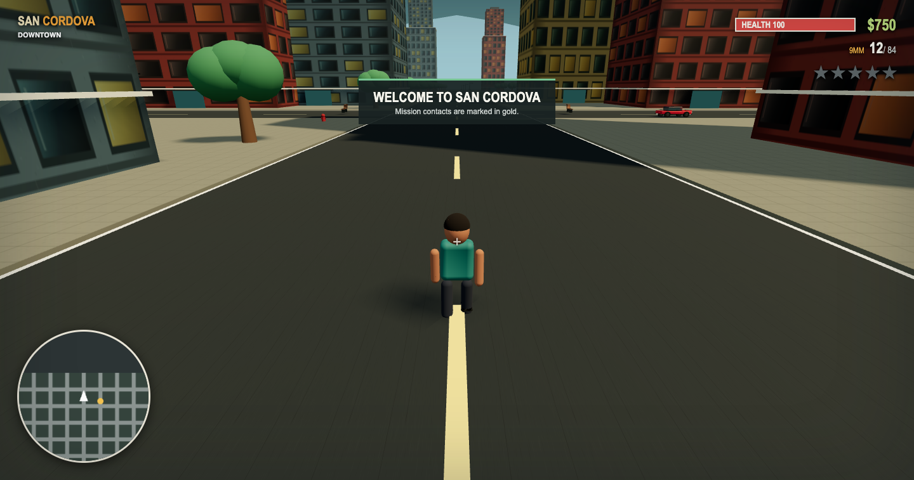

# San Cordova: Neon Reckoning

San Cordova is a compact, original open-world crime game built with Three.js and TypeScript. Explore five stylised districts on foot, take vehicles, weave through traffic, fight hostile crews, draw an escalating SCPD response, and complete three linked missions for local contacts.

The world is built at runtime from procedural geometry, instancing, canvas materials, CSS, and Web Audio, with two original GPT Image surface textures for asphalt and concrete. There are no borrowed maps, dialogue, music, or franchise assets.



## Run locally

Requirements: Node.js 22.x and npm 10.x.

```bash
npm install
npm run dev
```

Vite prints the local URL, normally `http://localhost:5173`.

```bash
npm run build   # strict TypeScript check and production bundle
npm run lint    # ESLint
npm test        # rendering-independent gameplay tests
```

## Heroku deployment

The production process builds the Vite bundle and serves `dist` from a small Node HTTP server. It listens on Heroku's assigned `PORT`, provides `/healthz`, compresses text assets, applies immutable caching to hashed assets, and falls back to `index.html` for client-side routes.

```bash
npm run build
PORT=4174 npm start
```

Pushes to `main` are verified and deployed to the `groot-theft-bakkie-6` Heroku app by `.github/workflows/deploy-heroku.yml`. Configure it once:

1. Push this repository to GitHub and keep `main` as the default branch.
2. In GitHub, open **Settings > Secrets and variables > Actions** and create the repository secret `HEROKU_API_KEY` using a Heroku authorization token or account API key.
3. Push to `main`, or run **Verify and deploy to Heroku** manually from the GitHub Actions tab.

The workflow runs install, lint, tests, and the production build before deployment. Do not also enable Heroku's dashboard auto-deploy for the same branch, because that would create duplicate releases.

## Controls

| Input | On foot | In a vehicle |
| --- | --- | --- |
| `WASD` | Camera-relative movement | Accelerate, brake/reverse, steer |
| Mouse | Orbit camera and aim | Orbit chase camera |
| `Shift` | Sprint | - |
| `Space` | Jump | Handbrake |
| `E` | Talk, collect, enter vehicle | Exit vehicle |
| Left mouse | Fire pistol | - |
| `R` | Reload | - |
| `F` | Mug or melee a nearby pedestrian | Recover vehicle to the nearest road |
| `Escape` | Pause and settings | Pause and settings |
| Backquote | Toggle FPS display | Toggle FPS display |

Click the game view to recapture the mouse after leaving pointer lock.

## Playing

Gold columns mark the nearest available contact or current objective. Approach a contact and press `E`.

1. **Delivery Run**: borrow Mara Velez's yellow Cielo, complete three timed deliveries, and return the car.
2. **Hot Property**: steal a red Veloce downtown, survive the resulting pursuit, lose the SCPD, and reach the Costa Azul garage.
3. **Dockside Signal**: travel to Breakwater, defeat three guards, retrieve a radio key, escape the docks, and return it to the park.

Crimes add heat across five wanted levels. Police units spawn on distant roads, pursue the current player vehicle or the player on foot, and maintain heat while they have a nearby sighting. Break line of contact and stay away long enough for heat to decay.

Progress is saved periodically and after mission rewards. Money, completed missions, spawn location, audio level, mouse sensitivity, and the FPS preference use `localStorage`. The pause menu can reset the save.

## World and systems

- **Downtown**: a dense skyline built from five architectural families, including stepped towers, twin slabs with glass bridges, cross-plan high-rises, rounded towers, elliptical crowns, facade fins, fire escapes, storefronts, roof plant, and signs.
- **Las Palmas**: landscaped residential streets with four house and apartment families, pitched terracotta roofs, offset wings, dormers, porches, balconies, chimneys, a garden park, and local shops.
- **Mercado Industrial**: four warehouse families with repeated gables and sawtooth profiles, loading docks, exterior pipework, ducts, silos, stacks, a water tower, containers, gantry cranes, and loading yards.
- **Costa Azul**: beach frontage, animated water, boardwalk kiosks, palms, lifeguard station, marina sculpture, and promenade railings.
- **Cordova Commons**: a formal civic park with paths, mature planting, fountain, and public sculpture. Harbor Courts and Las Palmas Garden provide two additional distinct parks.
- A detailed articulated player character with GPT Image fabric materials, layered clothing, facial features, jointed elbows and knees, procedural footwork, breathing, sprinting, jumping, and two-handed aiming poses.
- Compact, sport, van, and police vehicle configurations with distinct speed, acceleration, turning, braking, durability, wheels, brake lights, engine synthesis, and recovery.
- Twelve connected road systems with curved arterials, diagonal boulevards, district loops, industrial spurs, residential crescents, a harbor drive, parking areas, named street signs, regulatory signs, crossings, and road-derived traffic/minimap routing.
- Seven animated traffic-light junctions, bus shelters, corrected curbside lighting, benches, hydrants, shrubs, broadleaf street trees, and coastal palms.
- Pooled lane-following traffic routes, recycling, stuck recovery, simplified distance updates, and collision response.
- Raycast pistol combat with ammunition, reloads, distance damage, muzzle light, impact particles, and generated sound.
- Carjacking with fleeing drivers, street mugging, aggressive civilians, melee attacks, and persistent stylized blood spray and ground decals.
- Health, death, timed respawn, mission rewards, five-level wanted state, SCPD chase units, circular rotating minimap, and contextual HUD.

See [ARCHITECTURE.md](ARCHITECTURE.md) for code ownership and data flow and [GAME_DESIGN.md](GAME_DESIGN.md) for game rules and tuning intent.

## Project layout

```text
src/
  core/       game rules, input, audio, camera, persistence
  entities/   player, vehicle, and pedestrian implementations
  systems/    combat, missions, population, police, wanted level
  ui/         DOM HUD, menus, and canvas minimap
  world/      deterministic procedural city and collision data
  Game.ts     composition root and runtime orchestration
```

## Performance

Repeated tree crowns, trunks, palms, shrubs, streetlights, and promenade railings use instanced meshes. Geometry and materials are shared within entities and districts, shadows are limited, distant traffic skips simulation, effects are short lived, and the renderer caps pixel ratio. The pause menu exposes an FPS display, and backquote toggles it directly.

## Known limitations

- Collision uses a stable 2D arcade model, not rigid-body suspension or destructible architecture.
- Traffic follows approximate lane corridors; animated signals are currently presentational and vehicles do not reserve intersections by phase.
- Pedestrian avoidance is collider based rather than navmesh or reciprocal crowd steering.
- Police search is proximity/timeout based; there is no street-by-street vision cone simulation.
- The compact campaign has one checkpoint spawn and no multiple save slots.
- Touch and gamepad controls are not implemented.

## Future improvements

Useful next steps are navmesh sidewalk routing, intersection reservations, vehicle suspension, occlusion-aware police vision, gamepad support, more ambient activity, and additional data-authored missions.

## Licensing

The project code and original procedural game content are provided under the repository's license. Dependency and asset details are in [ATTRIBUTIONS.md](ATTRIBUTIONS.md).
